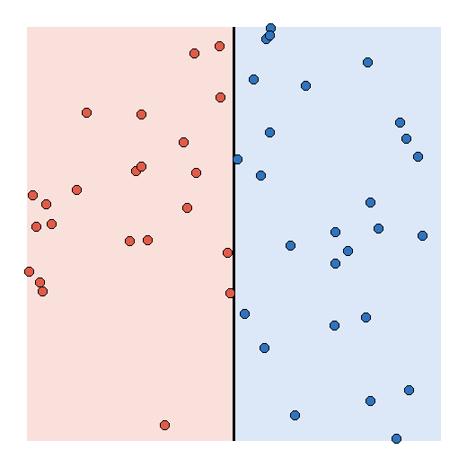

# MiniTorch Module 0


* Docs: https://minitorch.github.io/

* Overview: https://minitorch.github.io/module0/module0/

## task 0.5

for simple i just used the boundary `-10 * x1 + 5 = 0`.

```text
linear.weight_0_0 = -10
linear.weight_1_0 = 0
linear.bias_0 = 5
```

got 50/50 points right.


